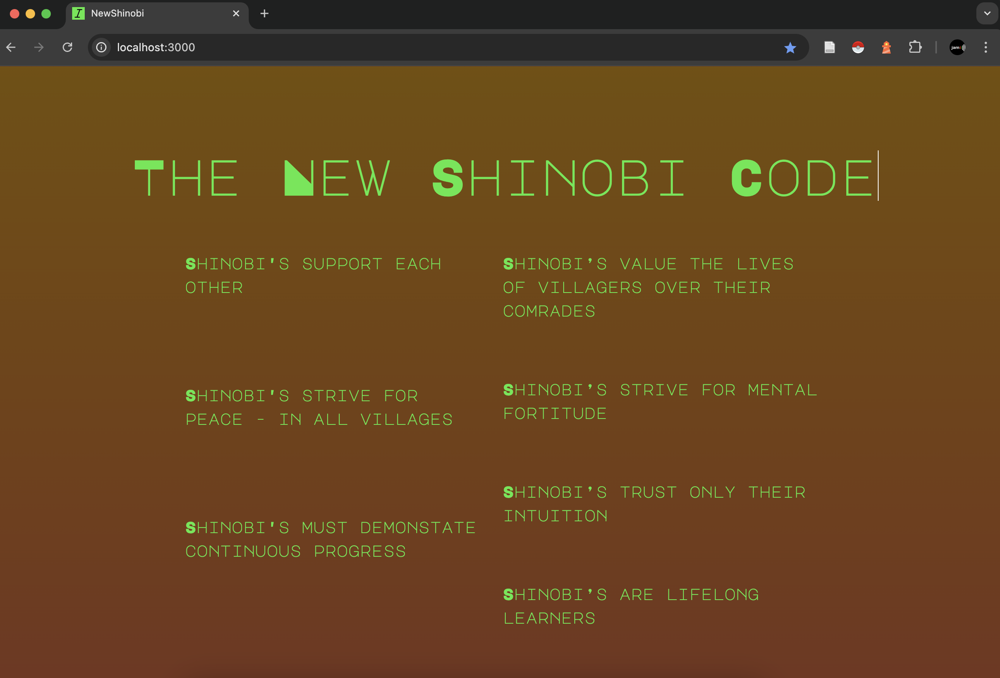

# The New Shinobi Code
*The New Shinobi Code* is a Ruby on Rails app that began while completing exercises in the Foundations of Humane Technology [course](https://www.humanetech.com/course).
Inspiration is taken from a Martin Luther King Jr. [quote](https://www.blackengineer.com/imported_wordpress/mlk-science-technology-society/#:~:text=“Through%20our%20scientific%20and%20technological,all%20perish%20together%20as%20fools.) and the anime [Naruto](https://en.wikipedia.org/wiki/Naruto).
*The New Shinobi Code* can be viewed [here](https://newshinobi.onrender.com/).

## Project Description
### Design/UI/UX
- User cards
  - for each user that joins to live by "The New Shinobi Code"
- Fan FAQ component
- Push notifications
  - Message: "Today, you live by the New Shinobi Code"
- Colors: Lime Green (46E840), Brown (744F00), Dark Purple (74005F)
- Font: Major Mono Display
## Technology(ies)
- HTML
- CSS
- Ruby version: 3.2.2
- Ruby on Rails: 7.1.4
### Deployment
- Netlify
### Domain
- Either newshinobi.com or newshinobi.live
## Inspiration
### Questions
How do we come up with cultural mechanisms to defend our psychological and cultural
borders?
How do we create a society without truth decay/misinformation while upholding the 
freedoms we hold dear?
Enter `The Village in the Hidden Door`
### The New Shinobi Code
To live by "The New Shinobi Code", one does not do so loudly, with social media posts, or telling friends and family. Practicing "The New Shinobi Code" is an internal practice. A practice of reflection. A practice of goodness. To ultimately better one's life and those in it.
### Quote
`Through our scientific and technological genius, we've made of this world a neighborhood. And now through our moral and ethical commitment, we must make of it a brotherhood. We must all learn to live together as brothers—or we will all perish together as fools.` - Martin Luther King Jr.

Things to cover as they become applicable:

* Ruby version

* System dependencies

* Configuration

* Database creation
  - `rails db:create`
* Database initialization

* How to run the test suite

* Services (job queues, cache servers, search engines, etc.)

* Deployment instructions
